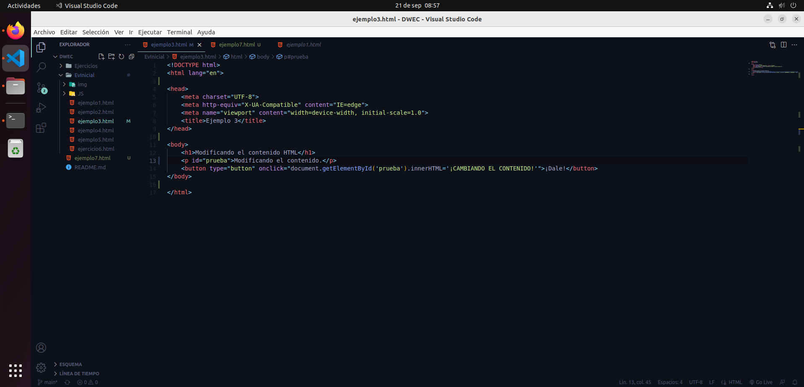
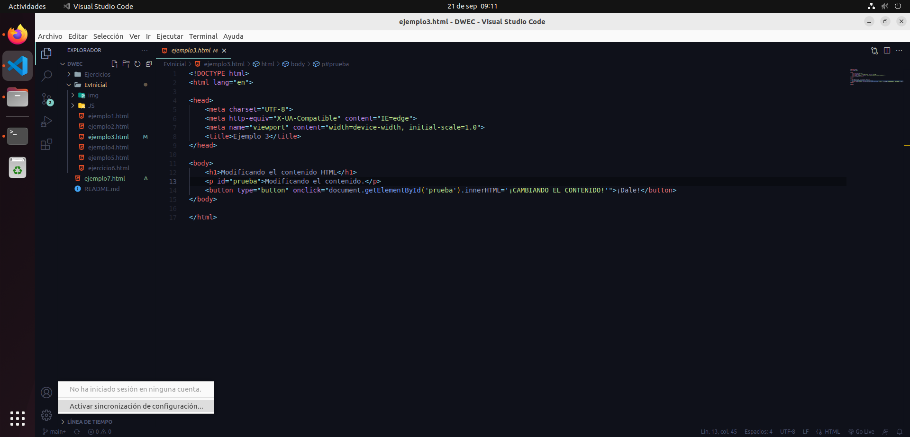
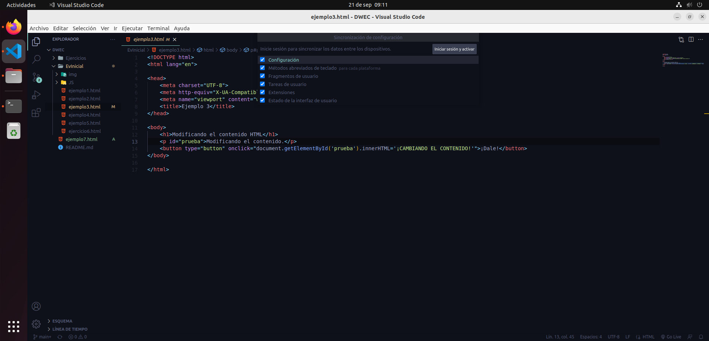
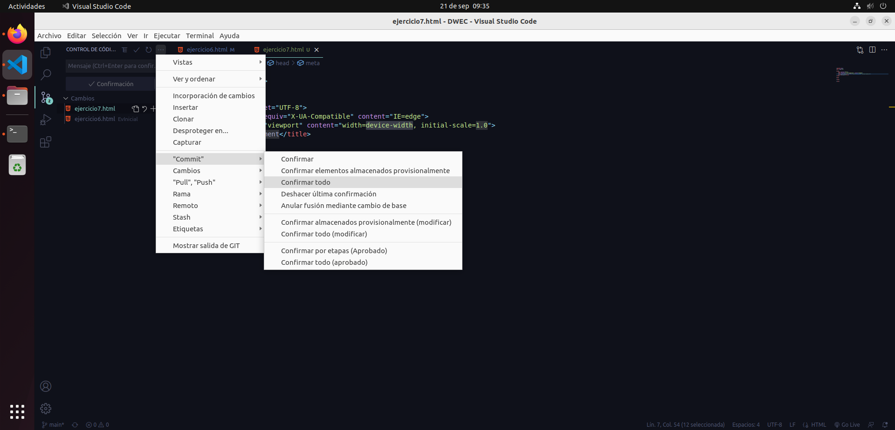
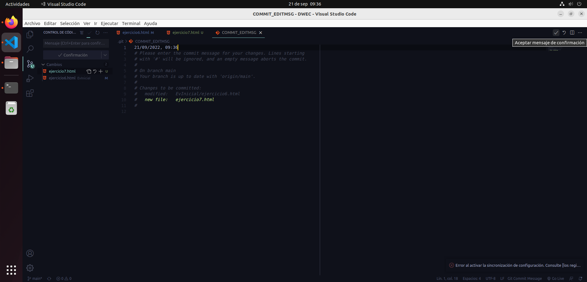
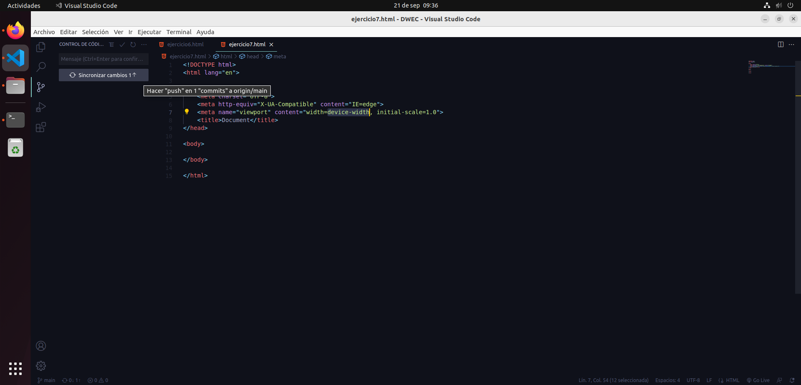
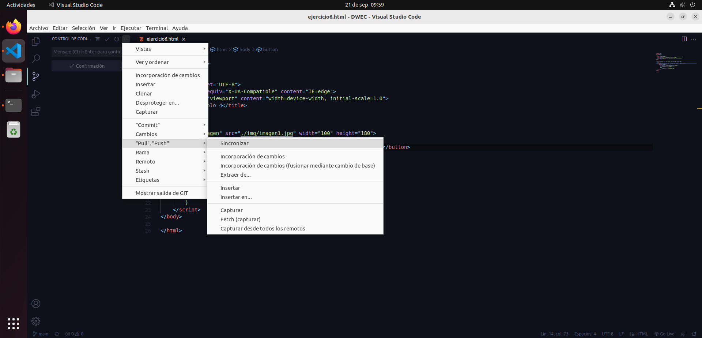
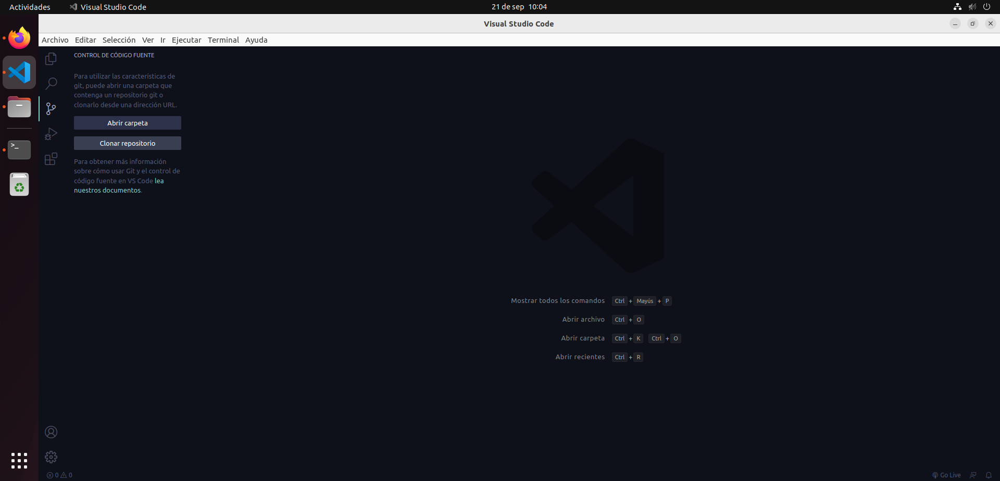
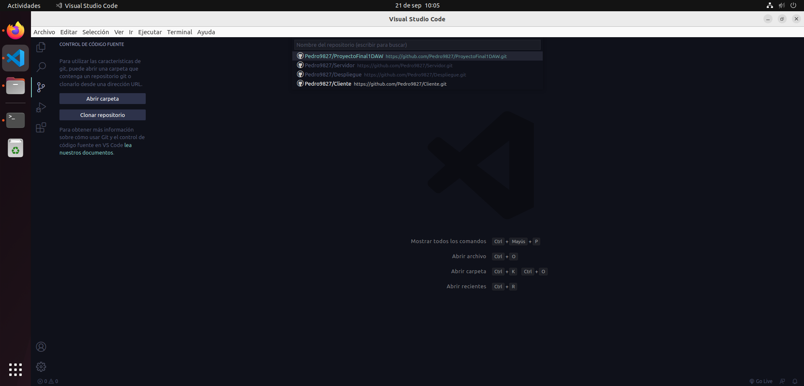

# Git en Visual Studio Code

## 0. Antes de empezar.
Para empezar, tenemos que tener instalados VS Code y Git, y contar con un repositorio local en nuestra máquina. 
 
Si lo tenempos, en VS Code abrimos el directorio en el que tenemos el repositorio local y ha debido detectar que ese directorio es un repositorio local y muestra cuando un archivo es modificado o no estaba previamente. 
 
La pestaña de control de código fuente también nos indica el nº de cambios que se han realizado en total. Pero aún no sabe dónde está el repositorio online, así que hay que iniciar sesión en github e indicar en git usuario y email. 
Cuentas -> Activar sincronización de configuración. 
 
Iniciar sesión y activar -> Iniciar sesión con github. 
 
Por último, introducimos los credenciales de GitHub y ya podemos empezar.
## 1. Sincornizar el repositorio remoto con el local (push).
Ahora podemos confirmar los cambios y sincronizarlos con el repositorio online. Vamos a Control de código fuente -> Opciones -> Commit -> Confirmar todo. 
 
Nos abrirá un archivo donde es necesario escribir un comentario que acompañe a nuestro commit. Una vez escrito, a la derecha de la pantalla le damos a confirmar. 
 
También se puede escribir escribir el comentario en el cuadro de texto que aparece justo encima de del botón de confirmación y luego darle a dicho botón, más rapido y sencillo. 
Y por último, a la izquierda nos saldrá el botón para sincronizar los cambios con github. 
 
Con esto, hemos hecho push del repositorio local al remoto.
## 2.- Sicronizar repositorio local on el online (pull).
Ahora supongamos que, desde otro equipo, hemos realizado cambios en el repositorio online y queremos sincronizarlo con el local desde VS Code.
Para traer esos cambios a nuestro repositorio local, lo que tenemos que hacer es dirigirnos a Control de código fuente -> Opciones -> “pull”, “push” -> Sincronizar.
 
O simplemente, si VS Code detecta cambios presentes en el repositorio online que no están presentes en local, nos saldrá la opción de hacer pull directamente sobre el botón en la pestaña de Control de código fuente.
Esto traerá al repositorio local los cambios del repositorio online.
## 3.- Clonar repositorio online (clone).
También puede darse el caso en el que tengamos un repositorio online pero no local, por lo que necesitaremos clonar dicho repositorio. Esto es tan sencillo como, desde la pestaña de control de código fuente, darle a clonar repositorio.
 
Le damos a clonar desde github y nos pedirá permisos para acceder a nuestra cuenta. Una vez aceptado e iniciado sesión, nos saldrá un listado de los repositorios que tenemos en github, seleccionamos el que queramos.
 
Y dicho repositorio se clonará en la ubicación que le indiquemos.
