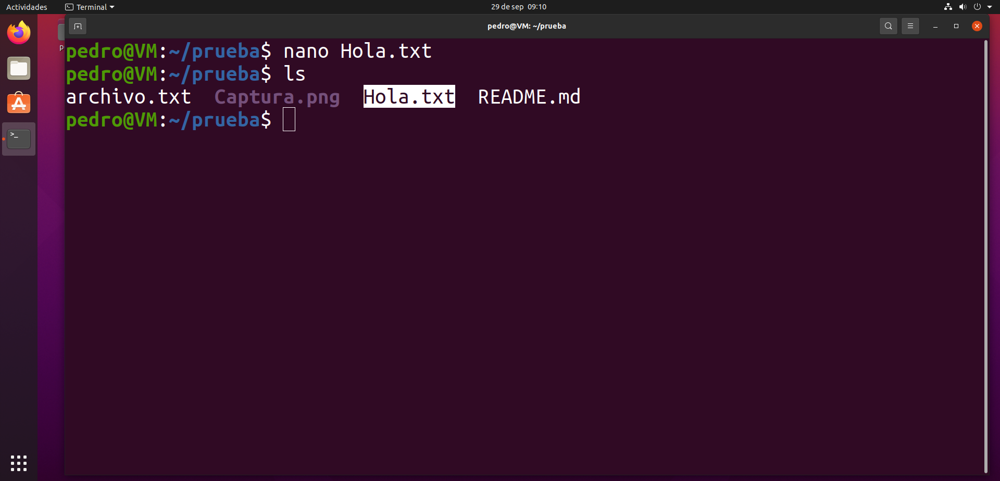

## Fork en github

Hacer 'fork' en un repositorio es una herramienta útil para traernos a nuestro GitHub un repositorio ajeno, sin afectar al original.  
Para ello, en GitHub, buscamos el repositorio que queramos bifurcar y le damos arriba a la derecha a la opción fork.  
 
Esto nos lleva a una pestaña donde podemos nombrar el nuevo repositorio y elegir las ramas a clonar.
 
Y ya tendríamos clonado el repositorio online, pero no local.
 
No existe la opción de fork en git, así que simplemente se hace una clonación del repositorio online.
 
Ahora, vamos a modificar el repositorio. Añadimos un archivo txt de ejemplo.
 
En GitHub, vamos a nuestro repositorio -> Contribute -> Open pull request.
 
Nos redirige a una pestaña donde podemos poner un título y comentario al commit. Una vez hecho le damos a Create pull request.
 
Al dueño del repositorio le llegará una solicitud nuestra para hacer merge con los repositorios.
 
Para aceptarla, entramos en la solicitud, y le damos a Merge pull request.
 
Y, si no hay incompatibilidades, en el repositorio original se aplicarán los cambios hechos en nuestro fork del mismo.
 

- [Volver al inicio](../index.md)
